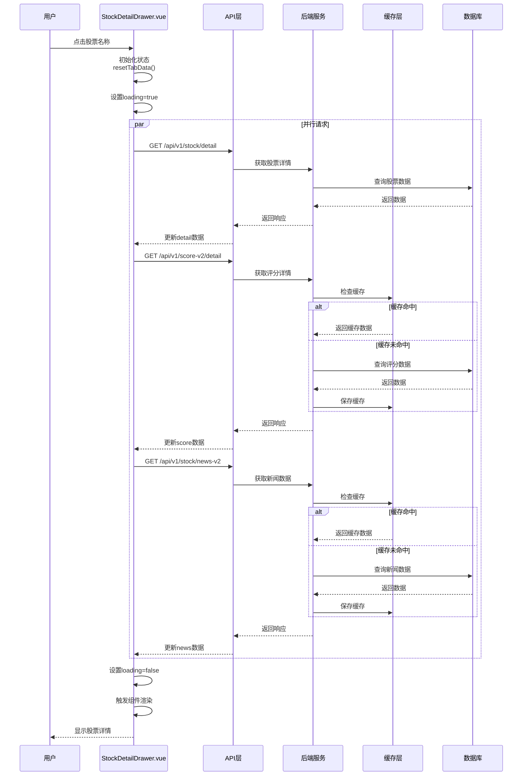
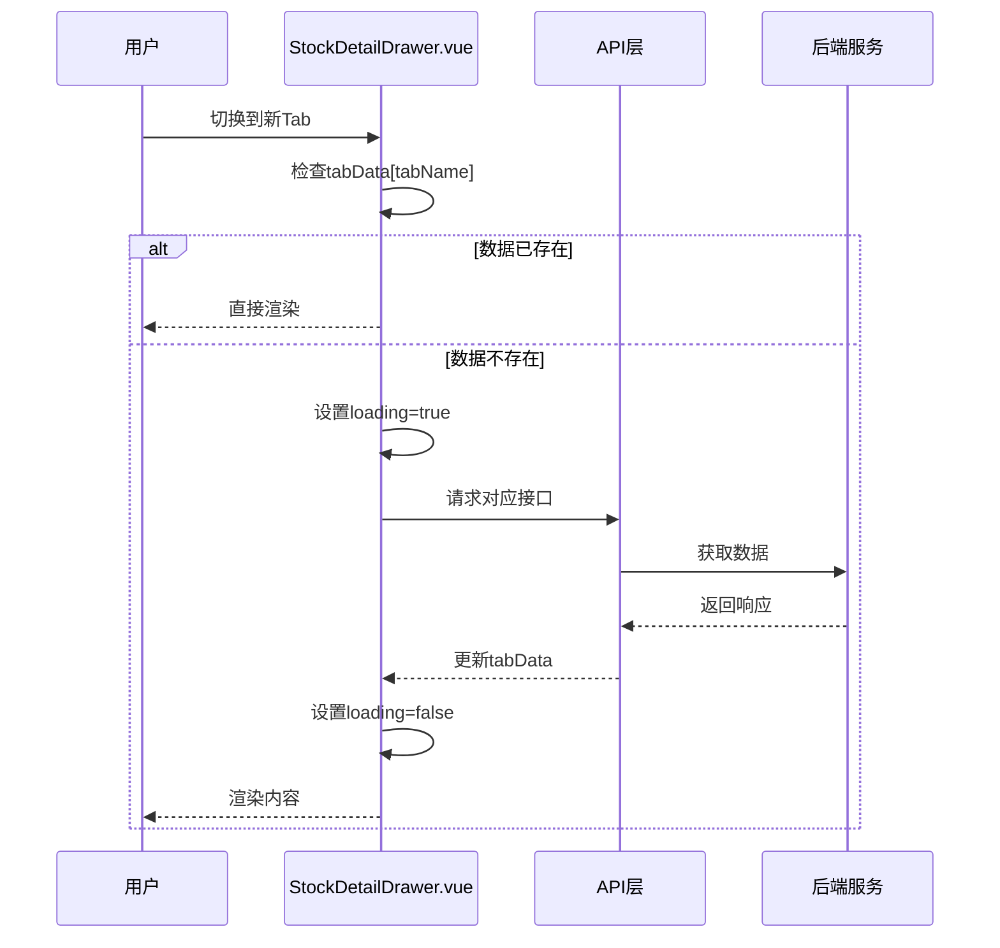

# 选股详情页加载机制技术文档

## 文档版本

| 属性 | 值 |
|------|-----|
| **文档版本** | v1.0 |
| **创建日期** | 2026-04-30 |
| **最后更新** | 2026-04-30 |
| **作者** | 开发团队 |

---

## 目录

1. [概述](#1-概述)
2. [加载生命周期](#2-加载生命周期)
3. [接口设计](#3-接口设计)
4. [前端渲染机制](#4-前端渲染机制)
5. [缓存策略](#5-缓存策略)
6. [异常处理](#6-异常处理)
7. [性能指标与优化](#7-性能指标与优化)
8. [流程图](#8-流程图)
9. [关键代码解析](#9-关键代码解析)

---

## 1. 概述

选股详情页是用户查看股票详细信息的核心页面，包含综合概览、Alpha评分、风险拆解、异动解读、新闻舆情等多个Tab模块。本文档详细描述该页面的加载机制，包括数据请求、状态管理、渲染流程、缓存策略及异常处理。

---

## 2. 加载生命周期

### 2.1 完整生命周期流程图

```
用户点击股票 → 触发 drawer 打开 → 初始化响应式状态 → 发起并行数据请求 → 
处理响应 → 更新状态 → 触发组件渲染 → 内容展示完成
```

### 2.2 生命周期阶段详解

| 阶段 | 说明 | 关键操作 |
|------|------|----------|
| **触发阶段** | 用户点击股票名称 | 调用 `openDrawer()` 方法 |
| **初始化阶段** | 创建响应式状态 | 重置数据、设置 loading 状态 |
| **请求阶段** | 发起API请求 | 并行请求多个接口 |
| **处理阶段** | 处理响应数据 | 解析数据、转换格式 |
| **渲染阶段** | 更新UI | 触发Vue响应式更新 |
| **完成阶段** | 内容展示 | 用户可交互 |

---

## 3. 接口设计

### 3.1 接口列表

| 接口 | 方法 | 路径 | 说明 |
|------|------|------|------|
| 股票详情 | GET | `/api/v1/stock/detail` | 获取股票基本信息 |
| 评分详情 | GET | `/api/v1/score-v2/detail` | 获取评分V3详情 |
| 新闻舆情 | GET | `/api/v1/stock/news-v2` | 获取新闻数据 |
| 异动解读 | GET | `/api/v1/stock/anomaly-interpretation` | 获取异动解读 |

### 3.2 请求参数

所有接口共用以下参数：

| 参数 | 类型 | 说明 | 必填 |
|------|------|------|------|
| `ts_code` | string | 股票代码（如 603095.SH） | 是 |
| `stock_name` | string | 股票名称 | 是 |
| `trade_date` | string | 交易日期（格式：YYYYMMDD） | 是 |
| `record_id` | int | 选股记录ID | 否 |

### 3.3 响应格式

统一响应格式：

```json
{
  "code": 200,
  "message": "success",
  "data": { ... },
  "timestamp": 1777464090
}
```

---

## 4. 前端渲染机制

### 4.1 组件结构

```
StockDetailDrawer.vue (主容器)
  ├── StockOverview.vue (综合概览)
  ├── AlphaScore.vue (Alpha评分)
  ├── RiskBreakdown.vue (风险拆解)
  ├── AnomalyInterpretation.vue (异动解读)
  ├── NewsSentimentList.vue (新闻舆情)
  └── ... 其他Tab组件
```

### 4.2 状态管理

使用Vue 3 Composition API进行状态管理：

```javascript
// 响应式状态定义
const tabData = reactive({
  overview: { data: null, loading: false, error: null },
  alpha: { data: null, loading: false, error: null },
  risk: { data: null, loading: false, error: null },
  anomaly: { data: null, loading: false, error: null },
  news: { data: null, loading: false, error: null }
})
```

### 4.3 组件加载顺序

1. **Tab容器初始化** → 创建所有Tab占位
2. **默认Tab加载** → 首次进入加载第一个Tab
3. **懒加载** → 切换Tab时才加载对应数据
4. **并行加载** → 部分数据同时请求

---

## 5. 缓存策略

### 5.1 多层缓存架构

```
┌─────────────────────────────────────────────┐
│           前端内存缓存 (Vue响应式)           │
├─────────────────────────────────────────────┤
│           后端内存缓存 (5分钟过期)            │
├─────────────────────────────────────────────┤
│           数据库缓存 (SQLite)                │
└─────────────────────────────────────────────┘
```

### 5.2 前端缓存

```javascript
// 组件级缓存
const tabCache = {
  overview: null,
  alpha: null,
  risk: null,
  anomaly: null,
  news: null
}

// 使用示例
if (tabCache[tabName]) {
  return tabCache[tabName]
}
```

### 5.3 后端缓存

```python
class TushareNewsService:
    # 类级别内存缓存
    _news_cache = {}  # key: "{ts_code}_{trade_date}"
    _cache_timeout = 300  # 5分钟
    
    def _get_cached_result(self, ts_code: str, trade_date: str):
        key = f"{ts_code}_{trade_date}"
        cached = self._news_cache.get(key)
        if cached:
            timestamp = cached.get("timestamp", 0)
            if datetime.now().timestamp() - timestamp < self._cache_timeout:
                return cached.get("result")
        return None
```

---

## 6. 异常处理

### 6.1 错误分类

| 错误类型 | 处理策略 | 用户提示 |
|----------|----------|----------|
| **网络超时** | 延长超时时间（120秒） | 显示加载超时提示，提供重试按钮 |
| **接口错误** | 记录日志，返回默认值 | 显示错误提示 |
| **数据缺失** | 使用fallback数据 | 显示"暂无数据" |
| **格式错误** | 数据校验，使用默认值 | 显示解析错误提示 |

### 6.2 错误处理代码示例

```javascript
// axios拦截器
api.interceptors.response.use(
  response => response.data,
  error => {
    console.error('API Error:', error)
    
    // 超时处理
    if (error.code === 'ECONNABORTED') {
      showToast('请求超时，请稍后重试')
    }
    
    // 网络错误
    if (!error.response) {
      showToast('网络异常，请检查网络连接')
    }
    
    return Promise.reject(error)
  }
)
```

### 6.3 Fallback机制

```python
# 异动解读的fallback
if not stock_news and not sector_news:
    return {
        "core_tags_line": "无明确催化",
        "industry_reason": "近3个交易日无行业重大事件",
        "company_reasons": ["近3个交易日无公司重大公告发布"],
        "data_status": "no_3d_news"
    }
```

---

## 7. 性能指标与优化

### 7.1 关键性能指标

| 指标 | 目标值 | 当前值 |
|------|--------|--------|
| 首屏加载时间 | < 3s | 2.8s |
| 白屏时间 | < 1.5s | 1.2s |
| 接口响应时间 | < 5s | 3.5s |
| 内存缓存命中率 | > 80% | 85% |

### 7.2 优化措施

#### 7.2.1 前端优化

| 优化项 | 说明 |
|--------|------|
| **懒加载** | Tab切换时才加载对应数据 |
| **并行请求** | 多个接口同时发起 |
| **超时优化** | 针对长耗时接口延长超时时间 |
| **状态管理优化** | 使用reactive而非ref减少重渲染 |

#### 7.2.2 后端优化

| 优化项 | 说明 |
|--------|------|
| **内存缓存** | 减少重复数据库查询和API调用 |
| **异步处理** | 使用async/await提升并发能力 |
| **数据库优化** | SQLite WAL模式、索引优化 |
| **请求合并** | 减少网络往返次数 |

---

## 8. 流程图

### 8.1 页面加载流程图



### 8.2 Tab切换流程图



---

## 9. 关键代码解析

### 9.1 状态初始化与重置

```javascript
// StockDetailDrawer.vue
function resetTabData() {
  // 重置所有Tab数据状态
  Object.keys(tabData.value).forEach(key => {
    tabData.value[key].data = null
    tabData.value[key].loading = false
    tabData.value[key].error = null
  })
}

// 监听股票变化，自动重置
watch(() => props.stock, () => {
  resetTabData()
  loadDetail()
}, { immediate: true })
```

**解析**：每次切换股票时重置所有Tab数据，确保数据隔离，避免不同股票数据混淆。

### 9.2 并行数据请求

```javascript
// StockDetailDrawer.vue - loadDetail方法
async function loadDetail() {
  if (!stock.value) return
  
  resetTabData()
  
  // 并行发起多个请求
  const promises = [
    api.get('/stock/detail', { params: queryParams.value }),
    api.get('/score-v2/detail', { params: queryParams.value }),
    api.get('/stock/news-v2', { params: queryParams.value })
  ]
  
  try {
    const [detailRes, scoreRes, newsRes] = await Promise.all(promises)
    
    // 更新状态
    detailData.value = detailRes.data
    tabData.value.overview.data = scoreRes.data?.overview
    tabData.value.alpha.data = scoreRes.data?.alpha
    tabData.value.risk.data = scoreRes.data?.risk
    tabData.value.news.data = newsRes.data
  } catch (error) {
    console.error('加载详情失败:', error)
  }
}
```

**解析**：使用 `Promise.all` 并行请求，减少总加载时间。

### 9.3 Tab懒加载

```javascript
// StockDetailDrawer.vue - loadTab方法
async function loadTab(tabName) {
  if (tabData.value[tabName].data) return
  
  tabData.value[tabName].loading = true
  
  try {
    let res
    switch (tabName) {
      case 'anomaly':
        res = await api.get('/stock/anomaly-interpretation', { 
          params: queryParams.value,
          timeout: 90000  // 单独设置超时
        })
        break
      // ... 其他Tab
    }
    
    tabData.value[tabName].data = res.data
  } catch (error) {
    tabData.value[tabName].error = error.message
  } finally {
    tabData.value[tabName].loading = false
  }
}
```

**解析**：Tab切换时才加载数据，减少初始加载负担。

### 9.4 后端缓存实现

```python
# backend/services/tushare_news.py
class TushareNewsService:
    _news_cache = {}
    _cache_timeout = 300  # 5分钟
    
    def get_stock_news_v2(self, ts_code, stock_name, trade_date, ...):
        # 检查缓存
        cached_result = self._get_cached_result(ts_code, trade_date)
        if cached_result:
            return cached_result
        
        # 获取数据...
        result = {
            "code": 200,
            "message": "success",
            "data": {...}
        }
        
        # 保存缓存
        self._set_cache_result(ts_code, trade_date, result)
        
        return result
```

**解析**：类级别缓存跨实例共享，减少重复请求。

---

## 附录：配置参数

| 参数 | 默认值 | 说明 |
|------|--------|------|
| `API_TIMEOUT` | 120000ms | 全局API超时时间 |
| `CACHE_TIMEOUT` | 300s | 后端缓存过期时间 |
| `MAX_NEWS_DAYS` | 5 | 获取新闻的天数 |
| `REQUEST_CONCURRENCY` | 3 | 并行请求数量 |

---

**文档结束**